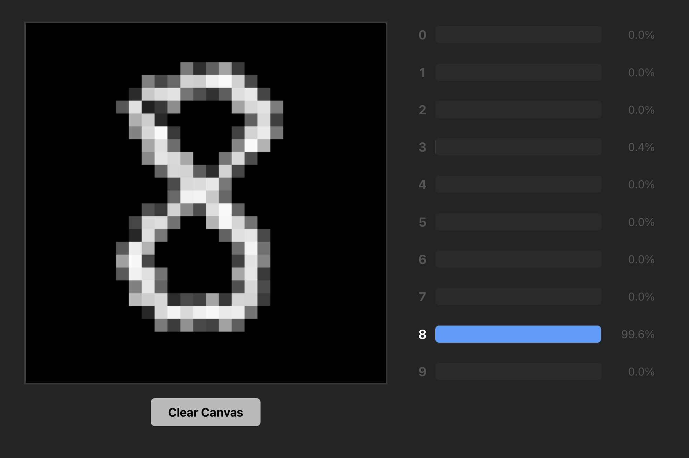

# MNIST Neural Network from Scratch

A neural network for handwritten digit recognition, built from scratch with NumPy - no TensorFlow, no PyTorch. Includes a React web app for live inference: draw a digit and get a real-time prediction.



## Project Structure

```
├── mnist_neural_net/
│   ├── number_recognition.ipynb    # Training notebook
│   ├── data/                       # MNIST dataset (not in repo)
│   └── models/                     # Saved model weights (.npz)
├── mnist_NN_react_app/
│   ├── classify_num_server.py      # Flask backend for inference
│   ├── src/
│   │   ├── Canvas.jsx              # Drawing canvas component
│   │   └── App.jsx                 # React entry point
│   └── package.json
├── pyproject.toml
└── README.md
```

## Setup

### Requirements

- Python 3.13+
- [uv](https://docs.astral.sh/uv/) (dependency management)
- Node.js (for the inference app)

### Training

1. Clone the repo:

   ```bash
   git clone https://github.com/FelixWolfram/Neural-Net-MNIST.git
   cd Neural-Net-MNIST
   ```

2. Install Python dependencies:

   ```bash
   uv sync
   ```

3. Download the MNIST dataset from [Kaggle](https://www.kaggle.com/datasets/oddrationale/mnist-in-csv) and place `mnist_train.csv` and `mnist_test.csv` in `mnist_neural_net/data/`.

4. Open `mnist_neural_net/number_recognition.ipynb` and run the training cells.

### Inference (React App)

1. Start the Flask backend:

   ```bash
   uv run python mnist_NN_react_app/classify_num_server.py
   ```

2. Start the React frontend (in a separate terminal):

   ```bash
   cd mnist_NN_react_app
   npm install
   npm run dev
   ```

3. Open `http://localhost:5173`, draw a digit on the canvas, and see the prediction.

## Network Architecture

- **Input**: 784 neurons (28x28 pixels, normalized to 0-1)
- **Hidden layers**: 64 and 32 neurons with sigmoid activation
- **Output**: 10 neurons with softmax

Training uses mini-batch gradient descent (batch size 1024, learning rate 0.32 with decay) and categorical cross-entropy loss. The best model reaches ~95% accuracy on the MNIST test set.

## Inference Pipeline

The React app renders a 28x28 grid canvas. When you draw, each stroke is snapped to the grid and the pixel data is sent to the Flask backend via POST request. The backend runs a feed-forward pass through the trained model and returns the predicted digit with confidence scores.
